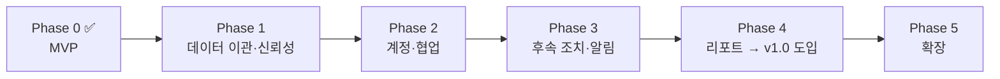

# 로드맵 — 영업 CRM 페이즈 분해

PRD([docs/PRD.md](./PRD.md))의 마일스톤을 실행 단위로 쪼갠 문서.
각 페이즈는 **독립적으로 배포 가능**하고, 완료 기준(DoD)을 만족하면 다음 페이즈로 넘어간다.

| 페이즈 | 테마 | 버전 | 예상 기간 | 상태 |
|---|---|---|---|---|
| 0 | MVP — 핵심 CRUD·칸반·대시보드 | v0.1 | — | ✅ 완료 (2026-07-14) |
| 1 | 데이터 이관 & 신뢰성 | v0.2 | 1~2주 | 대기 |
| 2 | 계정 & 협업 | v0.5 | 2주 | 대기 |
| 3 | 후속 조치 & 알림 | v0.8 | 1~2주 | 대기 |
| 4 | 리포트 & 정식 도입 | v1.0 | 1~2주 | 대기 |
| 5 | 확장 (피드백 기반) | v1.1+ | 미정 | 백로그 |

---

## Phase 0 — MVP ✅ (v0.1, 완료)

> 목표: 영업 데이터를 한곳에 모을 수 있는 최소 도구. 사내망에서 즉시 사용 가능.

**포함된 것**

- [x] 고객사/연락처/딜/활동 CRUD REST API (Node 내장 http + node:sqlite, 의존성 0)
- [x] 딜 파이프라인 칸반 (6단계, 드래그 & 드롭 이동, 컬럼별 합계)
- [x] 대시보드 (파이프라인 총액, 이번 달 성사, 단계별 현황, 마감 임박, 최근 활동)
- [x] 검색 (딜/고객사/연락처) + 단계 필터
- [x] 활동 타임라인 (통화/미팅/이메일/메모)
- [x] 데모 데이터 시드 (`npm run seed`)

**검증 완료**: API 스모크 테스트 + Playwright 브라우저 E2E (등록·검색·삭제 플로우)

---

## Phase 1 — 데이터 이관 & 신뢰성 (v0.2)

> 목표: 영업팀이 기존 스프레드시트를 버리고 넘어올 수 있게 한다. "데이터가 안전하다"는 신뢰 확보.
> 이 페이즈가 끝나면 **팀 파일럿(2~3명) 시작**.

| # | 작업 | 내용 | 크기 |
|---|---|---|---|
| 1-1 | CSV 가져오기 | 고객사/연락처/딜 각각 업로드. 컬럼 매핑 프리뷰, 중복(이름 기준) 스킵 리포트 | M |
| 1-2 | CSV 내보내기 | 딜 목록(현재 필터 반영)·고객사·연락처 다운로드. UTF-8 BOM(엑셀 호환) | S |
| 1-3 | 딜 단계 변경 이력 | `deal_stage_history` 테이블, 단계 변경 시 자동 기록, 딜 모달에서 이력 조회 | M |
| 1-4 | 일일 백업 스크립트 | `npm run backup` — DB 파일을 날짜별로 복사, 보존 14일. cron 등록 가이드 | S |
| 1-5 | 삭제 안전장치 | 고객사 삭제 시 연결된 딜/연락처 수 경고 표시, 활동 많은 딜 삭제 시 2차 확인 | S |
| 1-6 | 서버 테스트 도입 | `node --test` 기반 API 테스트 (CRUD, 검증, 이력 기록) — 이후 페이즈의 안전망 | M |

**완료 기준 (DoD)**
- 기존 영업 시트를 CSV로 넣었을 때 오류 없이 이관되고, 실패 행은 사유와 함께 리포트된다.
- 단계를 3번 옮긴 딜의 이력이 정확히 3건 조회된다.
- `npm test` 통과. 백업 파일이 생성·로테이션된다.

**의존성**: 없음 (즉시 착수 가능)

---

## Phase 2 — 계정 & 협업 (v0.5)

> 목표: "누가" 했는지가 남는다. 팀 전체가 함께 써도 서로의 데이터가 구분된다.
> 이 페이즈가 끝나면 **영업팀 전원 사용 시작**.

| # | 작업 | 내용 | 크기 |
|---|---|---|---|
| 2-1 | 사용자 테이블 & 로그인 | 이메일+비밀번호(scrypt 해시), 세션 쿠키(내장 crypto). 초기 계정은 CLI로 생성 | M |
| 2-2 | 인증 미들웨어 | 미로그인 시 API 401 + 로그인 화면. 정적 자원은 허용 | S |
| 2-3 | 딜 담당자 연결 | `deals.owner`(텍스트) → `owner_id`(users FK) 마이그레이션, 기존 값 매핑 스크립트 | M |
| 2-4 | 활동 작성자 기록 | 활동에 `user_id` 기록, 타임라인에 작성자 표시 | S |
| 2-5 | "내 딜" 필터 | 파이프라인/딜 목록에 담당자 필터 (기본값: 내 딜 / 전체 토글) | S |
| 2-6 | 이력에 행위자 기록 | Phase 1의 단계 이력에 `user_id` 추가 ("누가 언제 어떤 단계로") | S |

**완료 기준 (DoD)**
- 로그인 없이 API 호출 시 전부 401. 로그인 후 정상 동작.
- 딜 단계 이력에 실제 사용자 이름이 표시된다.
- 담당자 필터로 본인 딜만 볼 수 있다.

**의존성**: Phase 1의 마이그레이션 패턴·테스트 안전망

---

## Phase 3 — 후속 조치 & 알림 (v0.8)

> 목표: "놓치지 않는다". 도구가 다음 할 일을 알려주는 단계.

| # | 작업 | 내용 | 크기 |
|---|---|---|---|
| 3-1 | Task 모델 | 딜에 후속 조치(내용, 기한, 담당자, 완료 여부) 등록/완료 처리 | M |
| 3-2 | 대시보드 "오늘 할 일" | 기한 도래·경과 Task 목록, 경과 건 강조 | S |
| 3-3 | 방치 딜 감지 | N일(기본 14일) 활동 없는 진행 딜을 파이프라인 카드·대시보드에 표시 | S |
| 3-4 | 마감 경과 딜 처리 | 예상 마감일이 지난 진행 딜 목록 + 마감일 일괄 수정 UI | S |
| 3-5 | 딜 상세 패널 | 모달을 확장해 딜 1개의 활동 이력 + Task + 단계 이력을 한 화면에 | M |

**완료 기준 (DoD)**
- 기한이 어제인 Task가 대시보드 최상단에 빨간색으로 뜬다.
- 14일간 활동 없는 딜이 칸반 카드에서 시각적으로 구분된다.
- 딜 하나를 클릭하면 히스토리 전체(활동+단계+Task)를 한 화면에서 본다. → **"담당자 교체 시 히스토리만 읽고 인수인계" 목표 달성 지점**

**의존성**: Phase 2 (Task 담당자 = 사용자)

---

## Phase 4 — 리포트 & 정식 도입 (v1.0)

> 목표: 팀장·경영진이 회의 준비 없이 화면을 그대로 보고한다. **영업팀 정식 도입 선언.**

| # | 작업 | 내용 | 크기 |
|---|---|---|---|
| 4-1 | 전환율 리포트 | 단계별 진입 → 다음 단계 전환율, 최종 성사율 (이력 데이터 기반) | M |
| 4-2 | 단계 체류 기간 | 단계별 평균 체류 일수, 오래 머문 딜 상위 목록 | M |
| 4-3 | 월별 추이 | 월별 성사 금액/건수 차트 (최근 6개월) | S |
| 4-4 | 담당자별 현황 | 담당자별 파이프라인·성사 실적 (팀장 뷰) | S |
| 4-5 | 운영 문서 | 설치·백업·복구·계정 관리 운영 가이드 (docs/OPERATIONS.md) | S |
| 4-6 | 도입 체크리스트 | 시트 동결 선언, 전 데이터 이관 확인, KPI 측정 시작 | S |

**완료 기준 (DoD)**
- PRD의 KPI 4종을 화면에서 직접 측정할 수 있다.
- 주간 영업 회의가 CRM 화면만으로 진행된다 (별도 집계 자료 없음).

**의존성**: Phase 1(이력 데이터 축적), Phase 2(담당자별 집계)
※ 4-1·4-2는 이력 데이터가 쌓여야 의미 있으므로, Phase 1 배포를 서두를수록 리포트 품질이 올라간다.

---

## Phase 5 — 확장 백로그 (v1.1+)

우선순위 미정. 정식 도입 후 사용 피드백으로 결정한다.

- 실패(lost) 사유 분류 및 원인 리포트
- Slack 알림 (딜 성사, 마감 임박, Task 기한)
- 권한 분리 (팀장/담당자/열람 전용)
- 이메일 연동 (발송 기록 자동 수집)
- 모바일 반응형 강화
- 쿼터(목표) 대비 달성률 — PRD 미결 사항 #4 답변 후

---

## 원칙

1. **페이즈당 하나의 사용자 가치** — "이관할 수 있다" → "함께 쓴다" → "놓치지 않는다" → "보고가 사라진다".
2. **매 페이즈 끝 = 배포** — 브랜치 머지 후 실제 사용자에게 릴리스. 다음 페이즈는 피드백 반영 후 착수.
3. **의존성 0 유지** — 외부 패키지 도입은 페이즈 리뷰에서 명시적으로 결정 (기본은 Node 내장 모듈).
4. **파괴적 스키마 변경 금지** — 마이그레이션 스크립트 필수, 백업 후 적용.
