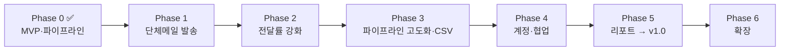

# 로드맵 — 영업 CRM 페이즈 분해

PRD([docs/PRD.md](./PRD.md))의 마일스톤을 실행 단위로 쪼갠 문서.
각 페이즈는 **독립적으로 배포 가능**하고, 완료 기준(DoD)을 만족하면 다음 페이즈로 넘어간다.

> **우선순위 원칙 (2026-07-15 확정)**: 가장 필요한 것은 ① 파이프라인 관리 ② 단체메일 ③ Gmail 스팸 회피.
> 파이프라인 기본형은 Phase 0에서 확보했으므로, **단체메일(Phase 1)과 전달률(Phase 2)을 최우선**으로 진행하고
> 파이프라인 고도화는 Phase 3에서 이어간다.

| 페이즈 | 테마 | 버전 | 예상 기간 | 상태 |
|---|---|---|---|---|
| 0 | MVP — 파이프라인·CRUD·대시보드 | v0.1 | — | ✅ 완료 (2026-07-14) |
| 1 | 단체메일 발송 | v0.2 | 2주 | **다음 착수** |
| 2 | 전달률 강화 (스팸 회피) | v0.3 | 1~2주 | 대기 |
| 3 | 파이프라인 고도화 & 데이터 이관 | v0.5 | 1~2주 | 대기 |
| 4 | 계정 & 협업 | v0.8 | 2주 | 대기 |
| 5 | 리포트 & 정식 도입 | v1.0 | 1~2주 | 대기 |
| 6 | 확장 (피드백 기반) | v1.1+ | 미정 | 백로그 |

---

## Phase 0 — MVP ✅ (v0.1, 완료)

> 목표: 영업 데이터를 한곳에 모을 수 있는 최소 도구. 파이프라인 관리 기본형 확보.

- [x] 고객사/연락처/딜/활동 CRUD REST API (Node 내장 http + node:sqlite, 의존성 0)
- [x] 딜 파이프라인 칸반 (6단계, 드래그 & 드롭 이동, 컬럼별 합계)
- [x] 대시보드 (파이프라인 총액, 이번 달 성사, 단계별 현황, 마감 임박, 최근 활동)
- [x] 검색 (딜/고객사/연락처) + 단계 필터
- [x] 활동 타임라인 (통화/미팅/이메일/메모)
- [x] 데모 데이터 시드 (`npm run seed`)

**검증 완료**: API 스모크 테스트 + Playwright 브라우저 E2E

---

## Phase 1 — 단체메일 발송 (v0.2) 🎯 다음 착수

> 목표: CRM에서 수신자를 골라 개인화된 메일을 안전하게 뿌리고, 이력이 고객별로 남는다.
> 끝나면 **첫 실제 캠페인 발송**.

| # | 작업 | 내용 | 크기 |
|---|---|---|---|
| 1-1 | 캠페인 데이터 모델 | `campaigns`(제목, 본문, 상태), `campaign_recipients`(수신자별 발송 상태), `unsubscribes` 테이블 | S |
| 1-2 | 수신자 세그먼트 | 연락처를 딜 단계/업종/고객사 필터로 선택. 이메일 없음·수신거부·중복 자동 제외 + 제외 사유 표시 | M |
| 1-3 | 템플릿 & 치환 변수 | `{{이름}}` `{{직함}}` `{{회사}}` `{{발신자}}` 치환, 템플릿 저장/재사용, 수신자별 렌더링 미리보기 | M |
| 1-4 | Gmail API 연동 | Google Cloud OAuth 클라이언트 + refresh token 발급 플로우(설정 가이드 포함), 내장 fetch로 `messages.send` 호출 — 외부 패키지 없이 구현 | M |
| 1-5 | 발송 엔진 | 수신자별 개별 발송(BCC 금지), 쓰로틀(기본 8초/통), 일일 한도(기본 400통, 초과분 다음 날 이월), 중단·재개 가능 | L |
| 1-6 | 테스트 발송 | 본인 주소로 실제 렌더링 확인 후에만 본발송 버튼 활성화 | S |
| 1-7 | 발송 이력 통합 | 캠페인 상세(수신자별 상태) + 연락처/딜 활동 타임라인에 자동 기록 (`email` 유형) | M |
| 1-8 | 서버 테스트 도입 | `node --test` 기반 API 테스트 (세그먼트 제외 로직, 치환, 한도) — 발송은 실수 비용이 커서 테스트 필수 | M |

**완료 기준 (DoD)**
- 딜 단계 '제안'인 연락처 20명에게 이름/회사가 치환된 메일이 8초 간격으로 발송되고, 각 연락처 타임라인에 기록된다.
- 수신거부 주소가 세그먼트에서 자동 제외되고 제외 사유가 보인다.
- 발송 중 서버를 재시작해도 미발송분부터 재개된다.
- `npm test` 통과.

**의존성**: Google Workspace OAuth 클라이언트 생성 (PRD 미결 #5 — 관리자 권한 필요)
**선행 확인**: 발신 계정 결정 (공용 sales@ vs 개인 계정, PRD 미결 #7)

---

## Phase 2 — 전달률 강화: Gmail 스팸 회피 (v0.3)

> 목표: "보내진다"에서 "**받은편지함에 도달한다**"로. Google 대량 발신자 가이드라인을 시스템으로 강제.
> 끝나면 **캠페인 정례화** (주 1회 등).

| # | 작업 | 내용 | 크기 |
|---|---|---|---|
| 2-1 | 도메인 인증 진단 | 앱 내에서 backpac.kr의 SPF/DKIM/DMARC DNS 레코드 조회(내장 `node:dns`) + 상태 대시보드 + 미비 시 설정 가이드 | M |
| 2-2 | 원클릭 수신거부 | `List-Unsubscribe` + `List-Unsubscribe-Post` 헤더, 본문 수신거부 링크 → 수신거부 페이지, 즉시 DB 반영 | M |
| 2-3 | 바운스 처리 | 발송 계정의 반송 메일(mailer-daemon) 주기 조회로 하드바운스 감지 → 주소 마킹, 이후 캠페인 자동 제외 | M |
| 2-4 | 워밍업 스케줄러 | 신규 발신 초기 일일 한도를 20 → 50 → 100 → 200 → 400으로 점증. 바운스율 2% 초과 시 자동 발송 중단 + 경고 | M |
| 2-5 | 콘텐츠 사전 점검 | 발송 전 린트: 단축 URL, 이미지 과다, 낚시성 제목 패턴, (광고) 표기 누락(광고성 체크 시), 수신거부 링크 누락 → 경고/차단 | S |
| 2-6 | 발신 평판 가이드 | Google Postmaster Tools 등록 문서 + 스팸 신고율 모니터링 체크리스트 (docs/DELIVERABILITY.md) | S |

**완료 기준 (DoD)**
- SPF/DKIM/DMARC 3종이 앱 화면에서 모두 초록불.
- Gmail 수신 테스트에서 메일이 받은편지함에 안착하고, 헤더에 `List-Unsubscribe` 존재, 수신거부 클릭 → 재발송 시 자동 제외 확인.
- 하드바운스 발생 주소가 다음 캠페인에서 자동 제외.
- 바운스율 임계 초과 시 발송이 실제로 멈춘다.

**의존성**: Phase 1 (발송 엔진)
**참고**: 2-1은 Phase 1과 병행 가능 — 도메인 인증은 첫 캠페인 전에 확인되어야 함

---

## Phase 3 — 파이프라인 고도화 & 데이터 이관 (v0.5)

> 목표: 파이프라인을 "옮기는 보드"에서 "관리 도구"로. 기존 시트 데이터를 완전 이관.

| # | 작업 | 내용 | 크기 |
|---|---|---|---|
| 3-1 | 딜 단계 변경 이력 | `deal_stage_history` 테이블, 자동 기록, 딜 화면에서 이력 조회 | M |
| 3-2 | 방치 딜 감지 | N일(기본 14일) 활동 없는 진행 딜을 칸반 카드·대시보드에 표시 | S |
| 3-3 | 마감 경과 딜 처리 | 예상 마감일 지난 진행 딜 목록 + 일괄 수정 UI | S |
| 3-4 | 딜 상세 패널 | 딜 1개의 활동 + 단계 이력 + 받은 캠페인 메일을 한 화면에 (인수인계 뷰) | M |
| 3-5 | CSV 가져오기 | 고객사/연락처/딜 업로드, 컬럼 매핑, 중복 스킵 리포트 | M |
| 3-6 | CSV 내보내기 | 딜/고객사/연락처 다운로드 (UTF-8 BOM, 현재 필터 반영) | S |
| 3-7 | 백업 스크립트 | `npm run backup` — 날짜별 복사, 14일 보존, cron 가이드 | S |

**완료 기준 (DoD)**
- 기존 영업 시트 CSV가 오류 없이 이관되고 실패 행은 사유와 함께 리포트된다.
- 딜 클릭 한 번으로 전체 히스토리(활동+단계+메일)를 본다.
- 14일 방치 딜이 칸반에서 시각적으로 구분된다.

**의존성**: Phase 1 (딜 상세에 캠페인 이력 포함)

---

## Phase 4 — 계정 & 협업 (v0.8)

> 목표: "누가" 했는지가 남고, 담당자별로 일이 구분된다. 발신 계정도 사용자별로.

| # | 작업 | 내용 | 크기 |
|---|---|---|---|
| 4-1 | 사용자 & 로그인 | 이메일+비밀번호(scrypt), 세션 쿠키, 초기 계정 CLI 생성 | M |
| 4-2 | 인증 미들웨어 | 미로그인 API 401 + 로그인 화면 | S |
| 4-3 | 딜 담당자 연결 | `deals.owner` 텍스트 → `owner_id` FK 마이그레이션 | M |
| 4-4 | 활동/이력 작성자 | 활동·단계 이력·캠페인에 `user_id` 기록, 화면 표시 | S |
| 4-5 | 내 딜 필터 | 파이프라인/딜 목록 담당자 필터 (기본: 내 딜) | S |
| 4-6 | 사용자별 발신 계정 | 사용자마다 본인 Gmail OAuth 연결 → 캠페인을 내 이름으로 발송 | M |

**완료 기준 (DoD)**
- 로그인 없이 API 전부 401. 단계 이력·활동·캠페인에 실제 사용자 이름 표시.
- 담당자 A가 만든 캠페인이 A의 계정에서 발송된다.

**의존성**: Phase 1(OAuth 플로우 재사용), Phase 3(마이그레이션 패턴)

---

## Phase 5 — 리포트 & 정식 도입 (v1.0)

> 목표: 팀장·경영진이 회의 준비 없이 화면을 그대로 보고한다. **정식 도입 선언.**

| # | 작업 | 내용 | 크기 |
|---|---|---|---|
| 5-1 | 전환율 리포트 | 단계별 전환율, 최종 성사율 (이력 기반) | M |
| 5-2 | 단계 체류 기간 | 평균 체류 일수, 정체 딜 상위 목록 | M |
| 5-3 | 월별 추이 | 월별 성사 금액/건수 (최근 6개월) | S |
| 5-4 | 캠페인 성과 리포트 | 캠페인별 발송/바운스/수신거부/회신(수동 마킹) 추이 | S |
| 5-5 | 담당자별 현황 | 담당자별 파이프라인·실적 (팀장 뷰) | S |
| 5-6 | 운영 문서 & 도입 체크리스트 | 설치·백업·복구·계정·발송 운영 가이드, 시트 동결 선언 | S |

**완료 기준 (DoD)**
- PRD의 KPI 전부(파이프라인 + 메일 지표)를 화면에서 직접 측정.
- 주간 영업 회의가 CRM 화면만으로 진행된다.

**의존성**: Phase 3(이력 데이터), Phase 4(담당자별 집계)

---

## Phase 6 — 확장 백로그 (v1.1+)

우선순위 미정. 정식 도입 후 사용 피드백으로 결정.

- 실패(lost) 사유 분류 및 원인 리포트
- Slack 알림 (딜 성사, 마감 임박, 캠페인 완료/중단)
- 후속 조치(Task) + 기한 알림
- 권한 분리 (팀장/담당자/열람 전용)
- 캠페인 예약 발송, 미회신자 팔로업 세그먼트
- 모바일 반응형 강화
- 쿼터(목표) 대비 달성률

---

## 원칙

1. **페이즈당 하나의 사용자 가치** — "모은다" → "보낸다" → "도달한다" → "관리한다" → "함께 쓴다" → "보고가 사라진다".
2. **매 페이즈 끝 = 배포** — 머지 후 실제 사용자에게 릴리스, 피드백 반영 후 다음 착수.
3. **의존성 0 유지** — Gmail 연동도 내장 fetch로 구현. 외부 패키지 도입은 페이즈 리뷰에서 명시적으로 결정.
4. **파괴적 스키마 변경 금지** — 마이그레이션 스크립트 필수, 백업 후 적용.
5. **발송 안전 우선** — 스팸 신고율·바운스율 임계 초과 시 자동 중단이 언제나 수동 발송보다 우선한다. 도메인 평판은 되돌리기 어렵다.
