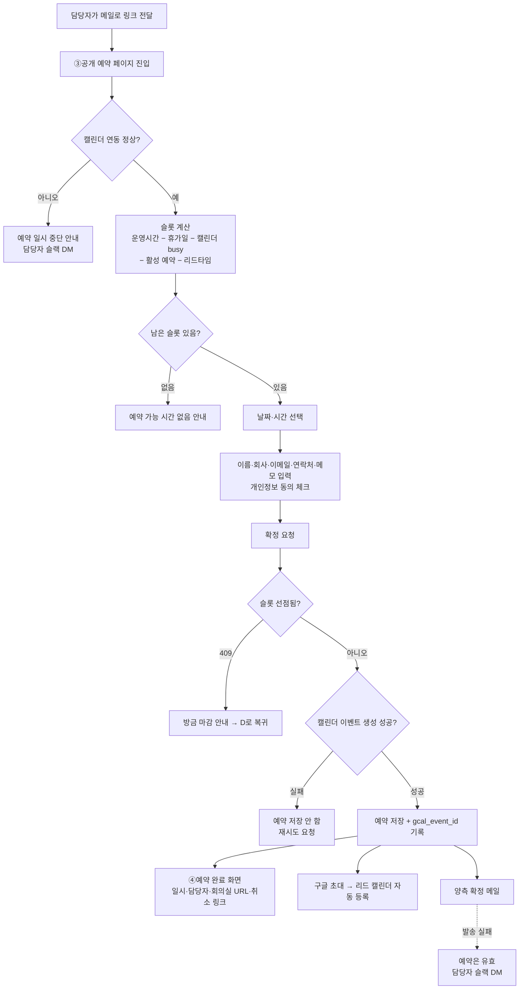

## PRD — 미팅 예약 링크 (영업 외부 미팅용)

**문제 정의**
영업팀이 외부 리드·파트너와 미팅을 잡을 때마다 메일로 가능 시간을 왕복 제안한다. 담당자 캘린더는 상시로 차 있어 제안한 시간이 확정 전에 다른 일정으로 덮이고, 확정 후에도 양쪽이 각자 캘린더에 손으로 넣는다. 링크 하나로 끝내고 싶다.

**목표**
영업 담당자가 예약 링크를 보내면 상대가 실제로 비어 있는 시간을 골라 확정하고, 확정 즉시 양쪽 캘린더에 일정이 들어간다.

**설계 원칙**
쓰는 사람은 영업팀 3~5명이고 트래픽은 없다. 큐·배치·분산 락은 만들지 않는다. 단, 예약 페이지는 **외부 고객이 보는 화면**이고 캘린더 정확성은 영업의 신뢰 문제라 이 두 가지는 아끼지 않는다.

---

**구현 최소화 결정**

| 흔한 설계 | 이 PRD | 근거 |
|---|---|---|
| Redisson 분산 락으로 동시 예약 방지 | `UNIQUE (page_id, start_at, canceled_ref)` + `DuplicateKeyException` → 409 | 동시 요청이 하루 1건 미만. 락 획득/해제/타임아웃 처리 불필요 |
| RabbitMQ 알림 이벤트 + DLQ 재처리 | 트랜잭션 커밋 후 동기 메일 발송, 실패 시 주최자 슬랙 DM | 메일 하루 몇 통. 큐를 태우면 발송 실패 관측·재처리 화면이 딸려온다 |
| Quartz 리마인더 배치 | **없음.** 캘린더 초대로 등록되면 구글이 알림을 준다 | 배치 + 발송 이력 테이블 + 중복 방지 로직이 통째로 불필요 |
| Quartz 개인정보 파기 배치 | Spring `@Scheduled` 일 1회, 쿼리 1개 | **파기는 멱등하다.** 여러 파드에서 중복 실행돼도 결과가 같아 Quartz의 클러스터 중복 방지가 필요 없다 |
| OAuth 앱 검증 대응 | **Internal 앱으로 게시** — 연동 주체가 사내 계정뿐이라 검증 절차 자체가 없다 | 원안의 개발 블로커가 여기서 소멸. 외부 예약자는 연동하지 않는다 |
| 이벤트 로깅 테이블 + Datadog 대시보드 | `booking` 테이블의 타임스탬프 컬럼 | 필요한 수치는 SQL 한 줄 |
| 예약 변경(1회) | 취소 후 재예약 | 변경은 "취소 + 예약"이라 별도 상태 전이·메일 템플릿이 필요 없다 |
| 취소 토큰 발급/검증 | `booking.id`(UUIDv4)를 링크에 사용 | 토큰 테이블·만료 정책 불필요 |
| 관리자 운영 화면 | **없음.** 담당자 변경은 링크 재생성, 조회는 DB | 5명이 쓰는 도구에 운영 화면을 만드는 비용이 사고 처리 비용보다 크다 |
| 30분 드래그 그리드(되는시간형) | 주최자가 후보 3~8개를 찍고 참석자가 O/X | tumblbug-ui **신규 컴포넌트 0개** |
| 라운드로빈 팀 배정 | 담당자 개인 링크 (확정) | 영업팀이 담당자별로 리드를 맡는 방식. 배정 규칙·부하 분산·가용성 합산이 전부 불필요 |
| 타임존 감지·변경 | KST 고정 (확정) | 해외 리드 없음 |

**규모**: 테이블 3개(v1) / 5개(v2), 엔드포인트 14개, 화면 7개.

---

**범위**

*v1 — 1:1 예약 링크*
- 예약 유형 CRUD (제목·설명, 소요시간 15/30/60분, 요일별 운영시간, 휴가일 제외, 최소 리드타임, 예약 가능 기간)
- 구글 캘린더 연동 (Internal OAuth, freebusy 읽기 + events 쓰기)
- 공개 예약 페이지 (비로그인, 회사 로고·담당자 이름 노출) + 슬롯 계산
- 예약 확정 → 캘린더 이벤트 생성 + 예약자 초대 + 양측 메일
- 예약자·주최자 취소

*v2 — 후보 시간 조율 + CRM 연동 (v1 배포 후 착수)*
- 주최자가 후보 시간 3~8개를 지정한 조율 링크 생성
- 참석자가 이름·이메일 입력 후 후보별 O/X 체크 (외부 참석자 대상이므로 로그인 없음)
- 응답 현황 테이블 + 주최자가 하나 선택해 확정 → 응답자 전원 캘린더 초대
- Salesmap 연동: 예약 확정 시 리드 조회·생성 + 미팅 노트 기록

*안 함*
드래그 그리드, 리마인더 발송, 반복 일정, 라운드로빈, 결제, 네이티브 앱, 관리자 운영 화면, Algolia, 아웃룩·애플 캘린더, Zoom/Meet 자동 회의실(주최자가 상시 회의실 URL을 예약 유형에 고정 입력).

---

**데이터 모델**

```
booking_page     id, member_id, title, description, duration_min,
                 weekly_hours(JSON), blocked_dates(JSON),
                 lead_time_hours, window_days, meeting_url,
                 slug(UNIQUE), active
booking          id(UUID), seq(AUTO_INCREMENT), page_id, start_at,
                 guest_name, guest_company, guest_email, guest_phone, memo,
                 gcal_event_id, created_at, canceled_at, canceled_ref
                 UNIQUE (page_id, start_at, canceled_ref)
calendar_token   member_id(PK), refresh_token, calendar_id, revoked_at
poll             id, member_id, title, candidate_slots(JSON), confirmed_slot
poll_response    id, poll_id, guest_name, guest_email, ox(JSON)
```
- 슬롯은 저장하지 않고 요청 시 계산한다 — `weekly_hours`를 JSON 컬럼에 두면 availability 테이블이 필요 없다.
- 슬롯 점유는 `canceled_ref`로 판별한다. 활성 예약은 `0`, 취소 시 자기 `seq` 값으로 갱신한다. **활성 예약은 `(page_id, start_at, 0)`이 중복되어 슬롯당 1건에서 막히고, 취소된 예약은 `canceled_ref`가 서로 달라 같은 슬롯에 얼마든지 쌓인다.**
- `canceled_at`(nullable)을 unique key에 넣으면 안 된다. **MySQL은 unique 인덱스에서 NULL을 서로 다른 값으로 취급하므로 활성 예약끼리 중복이 차단되지 않는다.** 판별 컬럼은 NOT NULL이어야 한다.
- 상태 컬럼은 따로 두지 않는다. `canceled_ref = 0` 여부가 곧 상태이고, `canceled_at`은 취소 시각 기록용이다.
- `guest_company`·`guest_phone`은 영업 리드 정보라 수집한다. 게스트 컬럼 5종(`guest_name`·`guest_company`·`guest_email`·`guest_phone`·`memo`)은 **전부 nullable**이어야 한다. 미팅 후 3개월이 지나면 이 컬럼들만 NULL로 비우고 row는 남긴다.

---

**기능 명세**

*캘린더 연동 (v1)*
- 담당자가 구글 계정을 연동하면 refresh token과 대상 캘린더 ID를 저장한다. OAuth 앱은 회사 Workspace **Internal**로 게시해 앱 검증 없이 사용한다.
- 슬롯 계산 시 freebusy API로 해당 기간의 바쁨 구간을 조회해 제외한다.
- 예약이 확정되면 담당자 캘린더에 이벤트를 생성하고 예약자를 참석자로 초대해 `gcal_event_id`를 저장한다. 초대 메일은 구글이 발송하므로 별도 리마인더를 만들지 않는다.
- 예약이 취소되면 `gcal_event_id`로 이벤트를 삭제한다.
- 캘린더 미연동 또는 토큰 철회 상태면 **예약 페이지를 열지 않고** "예약이 일시 중단되었습니다"를 노출하고 담당자에게 슬랙 DM을 보낸다. busy를 모르는 채로 예약을 받으면 이중 부킹이 나므로 열지 않는 쪽이 안전하다.
- 확정 시점의 캘린더 API 호출이 실패하면 예약을 저장하지 않고 재시도를 요청한다.

*예약 유형 (v1)*
- 담당자가 예약 유형을 저장하면 `/booking/{slug}` URL을 발급한다. 슬러그는 랜덤 8자, 충돌 시 재생성한다.
- 담당자가 비활성화하면 이후 열람자에게 "예약 마감"을 노출하고 기존 예약은 유지한다.
- 미래 확정 예약이 있는 예약 유형은 삭제를 차단한다.

*슬롯 조회·예약 (v1)*
- 예약 페이지 진입 시 `운영시간 − blocked_dates − 캘린더 busy − 활성 예약 − (현재 + 리드타임) 이전` 구간을 슬롯으로 계산해 KST로 표시한다. 취소된 예약의 시간은 다시 슬롯으로 노출한다.
- 슬롯은 각 요일 운영시간의 시작 시각을 기준으로 `duration_min` 간격으로 정렬한다. 운영시간 10:00–12:00 / 30분 미팅이면 10:00·10:30·11:00·11:30이고, 이 정렬을 벗어난 시각으로는 예약할 수 없다.
- 방문자가 슬롯을 선택하고 이름·회사명·이메일·연락처·메모를 입력하면 개인정보 수집 동의 후 예약을 확정한다.
- 확정 INSERT가 unique 제약에 걸리면 409를 반환하고 "방금 마감된 시간입니다" 안내 후 슬롯을 다시 불러온다.
- 확정 메일에는 예약 유형에 등록된 `meeting_url`(상시 회의실 링크)을 포함한다.
- 예약자가 확정 메일의 `/bookings/{uuid}/cancel` 링크로 접근하면 미팅 2시간 전까지 취소할 수 있다. 취소 시 캘린더 이벤트를 삭제하고 양측에 메일을 보낸다.
- 메일 발송이 실패하면 예약은 유효한 상태로 두고 담당자에게 슬랙 DM을 보낸다. 자동 재시도는 하지 않는다.

*개인정보 파기 (v1)*
- 매일 1회 `@Scheduled` 작업이 `start_at`이 3개월 이전인 예약의 `guest_name`·`guest_company`·`guest_email`·`guest_phone`·`memo`를 NULL로 갱신한다. 취소된 예약도 `start_at` 기준으로 동일하게 처리한다.
- row 자체는 남긴다. `page_id`·`start_at`·`created_at`만 남아 미팅 건수 집계는 계속 가능하고, 개인정보는 없다.
- 파기 대상 판정과 갱신은 멱등하므로 중복 실행·재실행을 허용한다. 실행 이력 테이블을 두지 않는다.
- 예약 페이지 동의 문구에 수집 항목과 "미팅 종료 후 3개월 보관 뒤 파기"를 그대로 노출한다.
- (v2) `poll_response`의 이름·이메일도 같은 기준으로 파기한다.

*후보 시간 조율 (v2)*
- 주최자가 후보 시간 3~8개를 선택하면 조율 링크를 발급한다.
- 참석자가 이름·이메일을 입력하고 후보별 O/X를 체크하면 저장한다. 같은 이메일로 재진입하면 자기 응답을 수정한다.
- 응답 현황을 후보 × 참석자 테이블로 보여준다.
- 주최자가 후보 하나를 확정하면 캘린더 이벤트를 생성하고 응답자 전원을 초대한다.

*CRM 연동 (v2)*
- 예약이 확정되면 `guest_email`로 Salesmap 리드를 조회한다. 없으면 이름·회사명·이메일·연락처로 신규 생성하고, 있으면 기존 리드를 사용한다.
- 해당 리드에 미팅 일시·담당자·메모를 담은 노트를 기록한다.
- Salesmap API 호출이 실패해도 예약은 유효하게 두고 담당자에게 슬랙 DM을 보낸다. 캘린더와 달리 CRM 기록은 사후 보완이 가능하므로 예약을 막지 않는다.

---

**유저 플로우**

*화면 목록*

| # | 화면 | 사용자 | 버전 |
|---|---|---|---|
| 1 | 예약 유형 목록 (캘린더 연동 상태 포함) | 영업 담당자 | v1 |
| 2 | 예약 유형 편집 | 영업 담당자 | v1 |
| 3 | 공개 예약 페이지 | 외부 리드 | v1 |
| 4 | 예약 완료 | 외부 리드 | v1 |
| 5 | 취소 확인 | 외부 리드 | v1 |
| 6 | 조율 생성 | 영업 담당자 | v2 |
| 7 | 조율 응답·현황 | 외부 참석자 / 담당자 | v2 |

*A. 최초 셋업 (담당자, 1회)*

```
①예약 유형 목록 → "구글 캘린더 연동" → 구글 OAuth 동의(Internal 앱)
   → refresh token 저장 → ②예약 유형 편집
   → 제목·설명·소요시간·요일별 운영시간·휴가일·리드타임·예약 가능 기간·회의실 URL 입력
   → 저장 → /booking/{slug} 발급 → 링크 복사
```
캘린더 연동이 예약 유형 생성보다 먼저다. 미연동 상태에서 만든 링크는 어차피 열리지 않는다.

*B. 예약 (외부 리드) — 본 플로우*



핵심은 **J 분기**다. 캘린더 이벤트 생성이 실패하면 예약을 저장하지 않는다. 예약은 있는데 캘린더에 없는 상태가 영업에서 가장 나쁜 실패다.

*C. 취소*

| 주체 | 경로 | 조건 | 결과 |
|---|---|---|---|
| 외부 리드 | 확정 메일의 `/bookings/{uuid}/cancel` → ⑤취소 확인 | 미팅 2시간 전까지 | `canceled_at`·`canceled_ref` 기록 → 캘린더 이벤트 삭제 → 양측 메일 → **슬롯 재개방** |
| 외부 리드 | 동일 | 2시간 이내 | 차단, 담당자 직접 연락 안내 |
| 담당자 | ①예약 유형 목록 → 예약 상세 | 제한 없음 | 동일 |

*D. 예약 후 (v1 / v2)*

```
v1: 확정 → 담당자가 Salesmap에 수동 입력 → 미팅 → 3개월 후 게스트 정보 자동 파기
v2: 확정 → Salesmap 리드 조회·생성 + 미팅 노트 자동 기록 → 미팅 → 3개월 후 파기
```

*E. 후보 시간 조율 (v2)*

```
담당자: ⑥조율 생성 → 후보 시간 3~8개 선택 → 조율 링크 발급 → 참석자에게 전달
참석자: ⑦조율 응답 → 이름·이메일 입력 → 후보별 O/X 체크 → 저장
        (같은 이메일 재진입 시 자기 응답만 수정)
담당자: ⑦현황 테이블(후보 × 참석자) → 후보 하나 확정
        → 캘린더 이벤트 생성 + 응답자 전원 초대 → 확정 메일
```

---

**엣지케이스**

| 케이스 | 동작 |
|---|---|
| 동일 슬롯 동시 확정 | unique 제약 위반 → 409, 슬롯 목록 갱신 |
| 취소한 시간에 다시 예약 | 가능해야 한다. 취소 시 `canceled_ref`가 0에서 벗어나 슬롯 점유가 풀린다 |
| 미팅 2시간 이내 취소 시도 | 차단, 담당자에게 직접 연락 안내 |
| 캘린더 토큰 만료·권한 철회 | 예약 페이지 중단 + 담당자 슬랙 DM. busy를 모르는 채로 예약받지 않는다 |
| 캘린더 API 장애로 확정 실패 | 예약 저장하지 않고 재시도 요청. 유령 예약을 만들지 않는다 |
| 운영시간 변경으로 기존 예약이 범위 밖으로 이탈 | 기존 예약 유지, 저장 시 경고 문구 노출 |
| 확정 메일이 제3자에게 전달됨 | UUID를 아는 사람은 취소가 가능하다. 취소 시 담당자에게 알림이 가므로 복구 가능한 범위로 감수한다 |
| 메일 발송 실패 | 예약과 캘린더 이벤트는 유효. 담당자 슬랙 DM 후 수동 재발송 |
| 담당자 퇴사 | 예약 유형 비활성화 + 미래 예약은 DB에서 수동 정리 |

---

**인수 조건**
- [ ] 예약 유형 설정대로 슬롯이 계산되고, 캘린더 busy 구간·휴가일·리드타임 미달 구간이 제외된다.
- [ ] 동일 슬롯 동시 요청 시 확정 예약이 정확히 1건이고 나머지는 409를 받는다.
- [ ] 예약을 취소한 뒤 같은 시간이 다시 예약 가능 슬롯으로 노출되고 재예약이 성공한다. 같은 슬롯을 여러 번 예약·취소해도 계속 성공한다.
- [ ] 확정 시 담당자 캘린더에 이벤트가 생기고 예약자에게 구글 초대가 발송된다. 취소 시 해당 이벤트가 삭제된다.
- [ ] 캘린더 미연동·토큰 철회 상태에서 예약 페이지가 예약을 받지 않는다.
- [ ] 캘린더 API 실패 시 예약이 저장되지 않는다.
- [ ] 미래 확정 예약이 있는 예약 유형은 삭제가 차단된다.
- [ ] 동의 없이 예약 확정이 불가하고, 수집 항목과 3개월 보관·파기 기준이 동의 문구에 그대로 열거되어 있다.
- [ ] 미팅 3개월 경과 예약의 게스트 정보 5개 컬럼이 NULL이 되고, `page_id`·`start_at`은 남아 건수 집계가 가능하다. 파기 작업을 두 번 실행해도 결과가 같다.
- [ ] (v2) 후보별 O/X 응답이 저장되고, 확정 시 응답자 전원이 캘린더에 초대된다.
- [ ] (v2) 예약 확정 시 Salesmap에 리드가 조회·생성되고 미팅 노트가 기록된다. API 실패 시에도 예약은 유효하다.

---

**의존성**
- BE: `core`에 booking 도메인, `api`에 공개 엔드포인트. 메일은 기존 알림 모듈(AWS SNS) 재사용. **RabbitMQ·Quartz·Redisson·Algolia 미사용.**
- FE: Next.js — 공개 예약 페이지 SSR, 슬롯 선택 CSR. **tumblbug-ui 기존 컴포넌트만 사용, 신규 컴포넌트 없음.**
- 외부: Google Calendar API (OAuth 2.0 **Internal 앱**, `calendar.freebusy` + `calendar.events`). GCP 프로젝트 발급 필요, 앱 검증 불필요.
- 외부(v2): Salesmap API — 리드 조회·생성, 노트 생성. v1에는 의존성 없음.
- 사내 인증은 기존 `admin` 계정 재사용.
- 앱 개발 리소스 미사용, 모바일 웹 반응형만.

**논의사항**
- v1 기간에는 예약 내용을 담당자가 Salesmap에 수동 입력한다. 자동 연동은 v2다.
- 예약 페이지 도메인·브랜딩 수준(로고만 vs 랜딩) — 외부 노출 화면이라 디자인 확인 필요.
- 개인정보 보관 기간은 미팅 후 3개월로 확정. 동의 문구 최종 문안은 법무 검토를 받는다(기간 자체는 재논의하지 않는다).

**관련 문서**
- 화면 와이어프레임 — `docs/prd/wireframes.html`
- 개발 핸드오프 (DDL·API·작업 분해) — `docs/prd/handoff.md`
