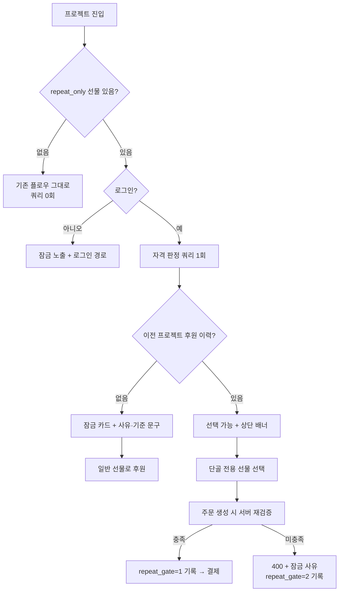

## PRD — 단골 후원자 혜택

**문제 정의**
창작자는 자기 프로젝트를 반복 후원한 사람이 누구인지 확인할 수 없다. 후원자 목록에는 이번 프로젝트의 후원 내역만 있어 세 번째 오는 사람과 처음 오는 사람이 같은 줄에 있다. 그래서 감사 표현도 차등 혜택도 불가능하고, 임의로 물품을 더 넣는 방식은 형평성·정산 문제로 창작자 스스로도 고르지 못한다.

**목표**
창작자가 자기 프로젝트의 반복 후원자를 식별하고, 그들에게만 열리는 선물을 정당한 절차로 제공할 수 있게 한다.

**설계 원칙**
이 기능은 창작자 리텐션 장치이고, 도는 돈은 기존 결제·정산 플로우 그대로다. 새 도메인을 만들지 않는다. 단, ① 후원자에게 **잠긴 선물이 보이는 화면**과 ② **자격 판정 근거의 사후 조회**는 아끼지 않는다. 전자는 이 기능의 동기 부여 장치 그 자체이고, 후자는 운영셀 3명이 분쟁을 감당할 유일한 방어선이다.

---

**구현 최소화 결정**

| 흔한 설계 | 이 PRD | 근거 |
|---|---|---|
| 후원 이력 집계 테이블 + Quartz 일 1회 배치 | **없음.** 판정은 결제 테이블을 그 자리에서 세는 쿼리 1개 | 판정 단위가 (창작자, 후원자) 페어라 인덱스 타면 스캔이 수십 건이다. 원안은 배치 값과 실시간 재검증 값이 갈라져 *"화면엔 후원자라는데 왜 잠기나"* 라는 CS를 스스로 만든다 — 원안이 세운 부작용 지표②의 최대 원인이 원안의 구조다 |
| 환불 시 집계 차감 로직 | **없음.** 결제 상태를 그때 읽으므로 자동 | 인수 조건 "환불 건이 즉시 차감된다"가 공짜로 만족된다. 배치를 두면 이 조건은 배치 주기만큼 반드시 깨진다 |
| 자격 기준 창작자 자유 입력 (N회 이상 / M원 이상) | **고정: 이 창작자의 이전 프로젝트를 후원한 이력 1건 이상.** 컬럼은 `repeat_only` boolean 1개 | **원안의 개발 블로커가 여기서 소멸.** 자유 입력이면 심사 판단 항목·CS 문답·문구가 기준 가짓수만큼 늘고(운영셀 3명, 축소 상태), 창작자는 그 숫자로 몇 명이 열리는지 모르는 채 값을 찍는다 |
| 자격선 "2회 이상" | **"이전 프로젝트 1건 이상"** (= 처음이 아닌 사람) | 원안의 2회 기준은 토글 활성 조건(과거 성공 프로젝트 1개 이상)과 **모순이다.** 과거 프로젝트가 1개인 창작자는 자격자가 구조적으로 0명이 된다. 문제 정의가 요구하는 구분선도 "3회 vs 1회"가 아니라 **"처음 vs 처음 아님"** 이다 |
| 금액 기준(M원 이상) | **없음** | 누적 결제액으로 선물을 여는 건 가격 정책이다. 할인·쿠폰을 OUT으로 둔 것과 같은 이유로 형평성 시비가 오히려 크고, 금액 노출이 아래 법무 리스크를 되살린다 |
| 창작자에게 후원자별 횟수·누적 후원액 표시 | **뱃지만.** 금액도 횟수도 숫자로 주지 않는다 | **원안의 개발 블로커(개인정보) 범위가 여기서 줄어든다.** 창작자는 자기 프로젝트별 후원자 목록을 이미 볼 수 있고 뱃지는 그 목록들의 교집합 표시다. 누적 결제액은 새로 만들어지는 노출이고, 창작자가 그 숫자로 할 행동이 이 PRD 범위에 하나도 없다 |
| 후원 횟수·누적액 정렬 | **없음.** 단골 필터 체크박스 1개 | 정렬해서 할 수 있는 행동(개별 메시지·쿠폰·등급 혜택)이 전부 OUT이다. 게다가 정렬은 전 후원자 집계를 요구해 방금 지운 집계 테이블을 되살린다 |
| 자격 보유자 진입 시 AWS SNS 알림 1회 | **없음.** 후원 페이지 상단 배너 | 지금 그 화면을 보고 있는 사람에게 푸시를 쏘는 셈이다. "1회만"을 지키려면 발송 이력 테이블·중복 방지·재시도·발송 실패 처리가 통째로 딸려온다 |
| 결제 시점 실시간 재검증 + 승인 완료 시각 재판정 | 주문 생성 시 1회 판정, 결과·시각을 주문에 기록 | 판정 후 자격이 **느는** 건 문제가 없고, **주는** 경우는 환불뿐인데 원안도 "기결제 건은 유지"다. 재판정할 대상이 실재하지 않는다 |
| 이벤트 로깅 테이블 신규 | 주문의 판정 스냅샷 컬럼 + 기존 FE 이벤트 파이프라인에 이벤트명 추가 | CS 사후 조회와 선택률 집계가 SQL 한 줄로 나온다 |
| 잠금 선물 카드 tumblbug-ui 신규 컴포넌트 | 기존 선물 카드의 `disabled` 상태 + 안내 문구 1줄 | **신규 컴포넌트 0개.** 앱도 기존 카드에 상태 하나. 원안의 FE·iOS·Android 신규 컴포넌트 3벌이 사라진다 |
| 단골 전용 비중 상한 정책 | 단골 전용이 **아닌** 선물이 1개 이상이어야 저장된다 | 비중 상한은 심사가 매번 비율을 재고 경계값을 다퉈야 한다. 일반 후원자의 선택지가 0이 되는 최악만 검증 한 줄로 막고 나머지는 시장에 맡긴다. **[데이터 필요]로 남은 상한값 정책이 불필요해진다** |
| 후원자 등급 신규 명칭 | 후원자 화면에 등급 이름을 쓰지 않는다 | 창작생태계 기여도 레벨(플랫폼 축)과의 **명칭 충돌이 소멸.** 후원자에게는 "이 창작자의 이전 프로젝트를 후원한 분께 열립니다"라는 사실만 쓴다. "단골"은 창작자 화면과 사내 용어로만 남는다 |

**규모**: 신규 테이블 0개, 변경 컬럼 3개, 신규 엔드포인트 0개, 신규 화면 0개, 배치 0개. 변경 화면 3개(프로젝트 편집·후원 페이지·창작자 후원자 목록).

---

**성공 지표**

| 지표 | 현재 값 | 목표 값 | 측정 방법 |
|---|---|---|---|
| 단골 전용 선물 설정률 (분모: 이전 성공 프로젝트 1개 이상 보유 창작자의 신규 오픈 프로젝트) | 0% | 오픈 후 4주 분포를 보고 확정 | `reward.repeat_only` 존재 여부 GROUP BY project |
| 자격 보유 방문자의 단골 전용 선물 선택률 (분모: 해당 프로젝트를 방문한 자격 보유 후원자) | 0% | 오픈 후 4주 분포를 보고 확정 | 방문 이벤트 × `orders.repeat_gate = 1` |
| 부작용① 자격 미보유 방문자의 방문→후원 전환율 | 동일 창작자 직전 프로젝트 값 | **하락 없음** | 방문 이벤트 × 결제 완료, 직전 프로젝트 대비 |
| 부작용② 단골 전용 관련 CS 인입 | 0 | 주 5건 초과 시 잠금 문구를 고친다 | CS 티켓 분류 태그 신규 1종 |

목표값 두 개는 기준선이 없어 비워 둔다. 다만 **관측 창은 오픈 후 4주로 확정**하고, 그때 분포를 보고 채운다. 지표②의 5건은 성과 목표가 아니라 **문구 개선 트리거**다 — 잠금 사유 문구가 1종으로 고정이라 문의가 몰리면 원인도 하나다.

---

**유저 스토리**
- 창작자로서, 반복 후원에 보답하기 위해 내 프로젝트를 전에도 후원한 사람을 알아보고 싶다
- 창작자로서, 형평성 시비 없이 혜택을 주기 위해 특정 선물을 그들에게만 열고 싶다
- 후원자로서, 계속 후원한 보람을 느끼기 위해 나에게만 열린 선물이 있다는 걸 알고 싶다
- 후원자로서, 헛되이 시도하지 않도록 왜 지금 고를 수 없는지 알고 싶다
- 운영자로서, 분쟁을 줄이기 위해 결제 건별 자격 판정 근거를 조회하고 싶다

---

**데이터 모델**

```
reward (기존)   + repeat_only     BOOLEAN  NOT NULL DEFAULT FALSE
orders (기존)   + repeat_gate     TINYINT  NOT NULL DEFAULT 0   # 0=해당없음 1=자격충족 2=차단
                + repeat_gate_at  DATETIME NULL                 # 판정 시각
```

- **신규 테이블이 없다.** 자격은 저장하는 값이 아니라 결제 이력에서 세어지는 값이다. 슬롯을 저장하지 않는 것과 같은 이유다.
- 자격 판정 쿼리 — 인덱스 `(supporter_id, creator_id, status)` 1개를 추가한다.
  ```sql
  SELECT EXISTS (
    SELECT 1 FROM orders o JOIN project p ON p.id = o.project_id
    WHERE o.supporter_id = ? AND p.creator_id = ? AND p.id <> ?   -- 현재 프로젝트 제외
      AND o.status = 'PAID' AND o.refunded_at IS NULL AND p.status = 'SUCCESS'
  )
  ```
- `repeat_gate`는 판정 **결과의 스냅샷**이다. 자격이 나중에 바뀌어도 이 값은 그대로 남아 CS가 "그때 왜 이렇게 판정됐나"에 답할 수 있다. 판정을 다시 돌려서 답하지 않는다 — 그 답은 지금 값이지 그때 값이 아니다.
- `repeat_gate = 0`은 단골 전용이 아닌 선물이라 판정 자체를 하지 않았다는 뜻이다. NULL을 쓰지 않는다. 집계에서 `= 1`, `= 2`가 각각 선택·차단 건수로 바로 나온다.
- 프로젝트 무산·미결제·환불은 위 조건절이 이미 배제한다. **별도 제외 로직을 만들지 않는다.**

---

**기능 명세**

*자격 판정 (BE / core)*
- 후원자가 로그인 상태로 프로젝트에 진입하면 위 쿼리로 자격을 판정한다.
- 프로젝트에 `repeat_only` 선물이 하나도 없으면 **쿼리를 실행하지 않는다.** 대다수 프로젝트에서 이 기능의 비용은 0이다.
- 비로그인 방문자면 판정하지 않고 잠금 상태로 노출한다. 잠금 문구에 로그인 경로를 함께 둔다.
- 주문이 생성되면 그 시점의 판정 결과와 시각을 `repeat_gate`·`repeat_gate_at`에 기록한다. 결제 승인이 나중에 떨어져도 다시 판정하지 않는다.
- 자격은 (창작자 계정 ID, 후원자 계정 ID) 기준이다. 창작자 계정 이관·팀 변경 시 이력을 승계하지 않는다 — 계정 ID가 그대로면 그대로 유지된다.

*선물 옵션 설정 (프로젝트 편집)*
- 창작자가 선물 옵션에서 "단골 전용" 토글을 켜면 `repeat_only = true`로 저장한다. **자격 기준 입력란은 없다.** 토글 옆에 적용될 기준을 문장으로 고정 노출한다.
- 이전에 성공한 프로젝트가 없는 창작자면 토글을 비활성화하고 사유를 노출한다. 켤 수 있어도 자격자가 0명이다.
- 단골 전용이 아닌 선물이 하나도 남지 않으면 저장을 차단한다.
- 오픈 전까지 토글을 켜고 끌 수 있다. 오픈 후에는 잠근다 — 후원 도중에 조건이 바뀌면 이미 고른 사람과 지금 고르는 사람의 기준이 달라진다.

*후원 플로우 (후원 페이지 — 웹·iOS·Android)*
- 자격 보유자면 단골 전용 선물을 일반 선물과 동일하게 선택 가능 상태로 노출하고, 선물 목록 상단에 배너를 1회 노출한다.
- 자격 미보유자면 **감추지 않고 잠금 상태로 노출한다.** 예약 슬롯을 감춘 결정과 반대인 이유는 명확하다 — 마감된 슬롯은 방문자가 열 방법이 없지만, **이 잠금은 후원자가 열 수 있다.** 감추면 "다음에도 후원하면 열린다"는 신호가 통째로 사라져 기능의 절반이 없어진다.
- 잠금 카드에는 사유와 기준을 한 문장으로 쓴다: *"창작자님의 이전 프로젝트를 후원하신 분께 열리는 선물이에요."* 등급 이름을 쓰지 않는다.
- 결제 요청 시 서버가 자격을 검증한다. 미충족이면 400과 잠금 사유를 반환하고 `repeat_gate = 2`로 기록한다. 선물 ID 직접 호출도 같은 경로로 막힌다.
- 잠금 카드는 기존 선물 카드의 `disabled` 상태를 쓴다. iOS·Android 동시 구현한다 — 후원 플로우는 앱 비중이 크고, 웹만 열면 앱에서 잠금 없이 결제되는 구멍이 생긴다. 서버가 막으므로 결제는 안 되지만 앱 사용자는 400을 보게 된다.

*창작자 후원자 목록 (창작자 페이지, 웹 전용)*
- 목록에 노출된 후원자에 한해 자격을 조회해 **"이전 후원자" 뱃지**를 표시한다. 횟수·누적 금액은 표시하지 않는다.
- "이전 후원자만 보기" 필터 체크박스를 제공한다. 정렬 기준은 추가하지 않는다.

*로깅·CS 조회*
- FE 이벤트: 단골 전용 선물 노출 / 잠금 노출 / 잠금 클릭 / 배너 노출. 기존 이벤트 파이프라인에 이름만 추가한다. **신규 테이블을 만들지 않는다.**
- 결제 차단은 `orders.repeat_gate = 2`가 곧 기록이다. 별도 이벤트를 쌓지 않는다.
- CS는 주문 조회 화면에서 `repeat_gate`·`repeat_gate_at`을 본다. 판정을 다시 돌리는 버튼은 만들지 않는다.

---

**후원 플로우**



`B` 분기가 이 설계의 비용을 결정한다. 단골 전용 선물이 없는 프로젝트 — 오픈 초기에는 거의 전부다 — 에서는 쿼리도 배너도 없다.

---

**범위**

**IN** — 자격 판정(실시간), 선물 옵션 `repeat_only` 토글(오픈 전 수정·해제), 후원 시 서버 검증, 잠금 카드·배너(웹·iOS·Android), 창작자 목록 뱃지·필터, 주문 판정 스냅샷, CS 조회, FE 이벤트 로깅.

**안 함**
집계 테이블·배치, 자격 기준 자유 입력, 금액 기준, 후원 횟수·누적액 노출, 횟수·금액 정렬, 자격 안내 알림(SNS), 잠금 카드 신규 컴포넌트, 비중 상한 정책, 오픈 후 조건 변경, 창작생태계 레벨 연동, 플랫폼 차원 후원자 등급, 창작자→후원자 개별 메시지, 단골 할인·쿠폰, 상시판매(Store) 적용.

---

**엣지케이스**

| 카테고리 | 케이스 | 동작 |
|---|---|---|
| 유저 행동 | 자격 미보유자가 선물 ID 직접 호출 | 400 + 잠금 사유. `repeat_gate = 2` 기록 |
| 유저 행동 | 비로그인 상태로 단골 전용 선물 클릭 | 잠금 노출 + 로그인 경로. 로그인 후 같은 페이지로 복귀 |
| 유저 행동 | 후원 후 취소해 자격 상실 | 기결제 건 유지. 다음 후원 시 그때 다시 센다 — 스냅샷은 남으므로 CS가 경위를 읽을 수 있다 |
| 유저 행동 | 창작자가 단골 전용에만 물량을 몰아 일반 선택지 소멸 | 저장 시 차단. 단골 전용이 아닌 선물이 1개 이상이어야 저장된다 |
| 유저 행동 | 이전 성공 프로젝트 없는 창작자가 토글 시도 | 토글 비활성 + 사유 노출 |
| 데이터 | 후원자 탈퇴 후 재가입 | 새 계정 ID라 이력이 조회되지 않는다. 별도 처리 없음 |
| 데이터 | 창작자 계정 이관·팀 변경 | 계정 ID 기준 유지, 승계하지 않는다. 별도 처리 없음 |
| 데이터 | 이전 프로젝트가 무산·환불됨 | 판정 쿼리 조건절이 배제한다. 차감 로직 없음 |
| 데이터 | 자격 경계선상 후원자 | 경계가 없다. 판정 시점에 세어진 값이 유일한 값이다 |
| 외부 시스템 | 결제 승인 지연(무통장 등) | 주문 생성 시 판정으로 확정. 승인 시점에 재판정하지 않는다 |
| 외부 시스템 | 판정 쿼리 실패·타임아웃 | 잠금 상태로 처리한다. 열어두면 자격 없는 결제가 통과하고, 잠기면 후원자가 재시도한다 |

---

**인수 조건**
- [ ] 결제 완료·미환불·프로젝트 성공 건만 자격으로 세어지고, 환불하면 **다음 조회에서 즉시** 빠진다.
- [ ] 이전 성공 프로젝트가 없는 창작자는 단골 전용 토글을 켤 수 없다.
- [ ] 단골 전용이 아닌 선물이 0개가 되는 저장이 차단된다.
- [ ] 오픈 후에는 `repeat_only` 값을 바꿀 수 없다.
- [ ] 자격 미보유자의 단골 전용 선물 결제가 UI와 API 양쪽에서 차단되고, 선물 ID 직접 호출도 400을 받는다.
- [ ] 잠금 카드에 사유와 기준이 문구로 노출되고, 그 문구에 등급 명칭이 등장하지 않는다.
- [ ] 비로그인 방문자에게 잠금 카드와 로그인 경로가 노출된다.
- [ ] 창작자 후원자 목록에 뱃지와 필터가 동작하고, **횟수·누적 금액이 어디에도 표시되지 않는다.**
- [ ] `repeat_only` 선물이 없는 프로젝트에서 자격 판정 쿼리가 실행되지 않는다.
- [ ] 결제 건에 `repeat_gate`·`repeat_gate_at`이 남아 CS 화면에서 조회된다. 이후 자격이 바뀌어도 값이 변하지 않는다.
- [ ] 노출·잠금 노출·잠금 클릭·배너 노출 이벤트가 기존 파이프라인으로 적재된다.
- [ ] iOS·Android에서 잠금 카드가 웹과 동일하게 동작한다.

---

**의존성**
- BE: `core`에 자격 판정 1개 + 인덱스 1개, `api`에 기존 결제 검증 확장. **batch 모듈·Quartz·RabbitMQ·Redisson·Algolia·AWS SNS 미사용.**
- FE: 기존 선물 카드 `disabled` 상태 + 문구. **tumblbug-ui 신규 컴포넌트 없음.** 후원 페이지 SSR 유지.
- 앱: iOS·Android 동시 구현. 기존 선물 카드에 상태 추가라 신규 화면 없음.
- 기존 결제·정산 플로우 회귀 테스트 — `reward` 스키마가 바뀐다.
- 심사 가이드에 항목 1줄 추가(단골 전용이 아닌 선물 1개 이상). **자격 기준이 고정이라 심사 판단 항목은 늘지 않는다.**
- CS 응대 스크립트 1종 + 티켓 분류 태그 1종. 잠금 사유가 1가지뿐이라 문답도 1가지다.
- 개인정보 처리방침·이용약관 검토 — 아래 논의사항 참조.

**논의사항**
- [개발 블로커] 창작자에게 "이 사람이 이전에도 후원했다"는 사실을 뱃지로 표시하는 것의 법적 근거. 원안의 금액·횟수 노출을 걷어내 **범위가 "이미 볼 수 있는 프로젝트별 후원자 목록의 교집합 표시"로 줄었다.** 기존 동의 범위로 커버되는지 확인이 필요하고, 미해결 시 창작자 화면(뱃지·필터)만 빠진다 — **후원 플로우는 자격을 창작자에게 보여주지 않으므로 이 블로커에 걸리지 않는다.** 원안에서 R1 전체가 멈추던 구조가 여기서 분리된다.
- 요금제 게이팅. 창작자 리텐션 기능이라 전 요금제 개방이 타당해 보이나 결정 필요. 구현상으로는 토글 노출 조건 한 줄이라 어느 쪽이든 비용이 같다.
- 목표값 2개는 오픈 후 4주 분포를 보고 채운다.
