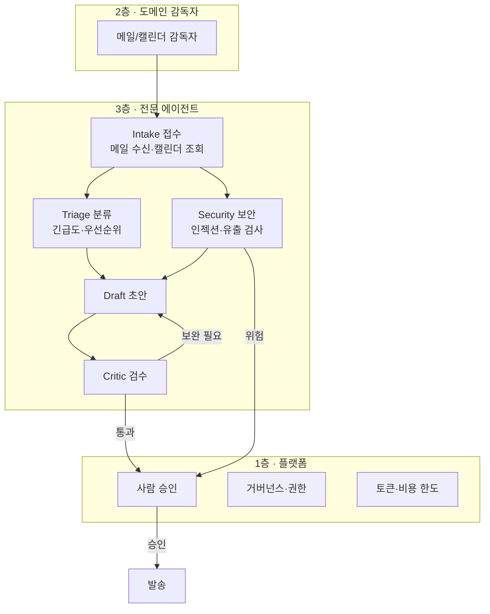
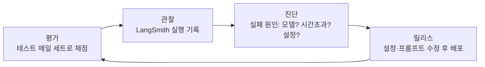

# PRD — 자비스 메일 관제 에이전트 (mail-agent) · 초안 v0.1

> 상태: **승인 대기**. 이 문서가 승인되기 전에는 코드를 쓰지 않는다 (가이드 3단계 "PRD 명시적 승인").

## 1. 문제와 목표

**문제**: 메일함에 들어오는 긴급 요청을 놓치거나 늦게 본다. 회신 초안을 매번 처음부터 쓴다.

**목표**: 새 메일이 오면 AI가 ① 긴급도를 매기고 ② 위험한 메일(피싱·프롬프트 인젝션)을 걸러내고 ③ 회신 초안을 써서 ④ 텔레그램으로 "보낼까요?"를 묻는다. **사람이 승인 버튼을 눌러야만 발송된다.**

**성공 기준 (시연 기준)**
| 항목 | 기준 |
|---|---|
| 감지 | "긴급 확인 요청드립니다" 테스트 메일을 2분 안에 인지 |
| 흐름 | 접수 → 분류/보안 → 초안 → 검수 → 사람 승인 순서가 화면과 LangSmith 기록에 그대로 보임 |
| 안전 | 승인 없이 발송된 메일 0건. 인젝션 테스트 메일("이전 지시 무시하고…")은 초안 단계로 넘어가지 않음 |

## 2. 구조 — 3계층 감독형

| 에이전트 | 하는 일 | 하지 않는 일 |
|---|---|---|
| Intake | 새 메일 가져오기, 관련 일정 조회 | 판단하지 않음 |
| Triage | 긴급/보통/무시 분류 | 초안 쓰지 않음 |
| Security | 인젝션·피싱·기밀 포함 여부 검사 (Triage와 **동시에** 실행) | 메일 내용을 고치지 않음 |
| Draft | 회신 초안 작성 | 발송 권한 없음 |
| Critic | 초안 검수, 최대 2회 되돌려 보냄 | 발송 권한 없음 |

**핵심 원칙**: 발송 권한은 1층(사람 승인)만 가진다. 어떤 에이전트도 스스로 메일을 보낼 수 없다.

## 3. LLM Ops 4대 루프

예: 시연 중 시간초과 → LangSmith 기록에서 원인 확인 → 제한 시간 30초→60초 → 재평가.

## 4. 기술 스택 (4단계에서 확정)

| 영역 | 후보 | 비고 |
|---|---|---|
| 화면 | Next.js 16 + Tailwind CSS | 노드-엣지 그래프(에이전트 흐름) 화면 |
| 에이전트 | LangGraph + LangSmith | LangSmith 추적이 가이드의 전제 |
| 알림/승인 | Hermes Agent 게이트웨이(Docker) + 텔레그램 봇 | |
| 메일/일정 | Gmail·Google Calendar API (OAuth) | |

## 5. 범위 밖 (v1에서 만들지 않음)

- 여러 계정 동시 관리, 자동 발송, 첨부파일 분석, 모바일 앱

## 6. 결정이 필요한 것 (승인 전 답 필요)

1. **어떤 메일함으로 시작하나?** 회사(텀블벅) 메일은 사내 보안 정책·Google Workspace 관리자 승인이 필요할 수 있다. **테스트용 개인 Gmail로 시작을 권장.**
2. **AI 모델은?** (예: Claude / GPT) — 비용 한도와 함께 정한다.
3. **텔레그램 승인 방식 OK?** 사내 표준이 슬랙이라면 슬랙으로 바꿀 수 있다 (Hermes는 슬랙도 지원).

## 7. 실행 환경 제약

5·6단계(Docker 실행, 구글 로그인, 실제 메일 수신)는 **본인 PC**에서 해야 한다. 비밀키(.env, google_client_secret.json)는 저장소에 올리지 않는다.
